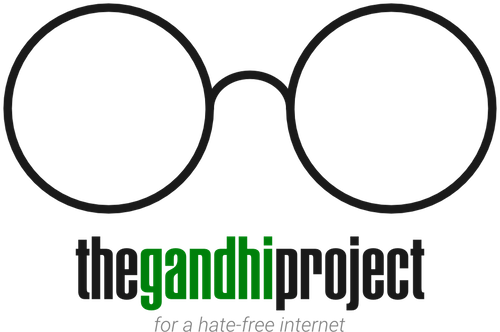

# Welcome

The Gandhi Project, or Gandhi for short, is a Chrome extension that uses Natural Language Processing (NLP) classification and machine learning to erase hateful and distasteful comments on the internet. Trained using over 6,000 hand-classified tweets, Gandhi figures out which comments are negative and removes them from the page before you even have a chance to read them. Currently, only YouTube and 4Chan are supported. Hopefully Facebook will be supported in the future, as it is a priority, but for now it is not as the site contains numerous ways you can view comments, and it will take a lot of time and effort before the extension is fully compatible with all of them.

As much hatred as there is on certain forums such as 4Chan, do note that this extension is intended to block hate from being intentionally directed at another individual. As a result, only comments are blocked and original posts (OPs) stay in-tact. Ideally you should be browsing at your own discretion, anyway.

### Building and Running Gandhi

To build Gandhi for the first time, simply `cd` into the directory and run:

`npm install && npm run build_and_train`

This will install all required dependencies, as well as build the extension and train the classifier using the include CSV dataset. Unless you run `npm run clean` in the future, you can just rebuild the extension by running

`npm run build`

To run the extension in Chrome, simply head on over to `chrome://extensions`, check "Developer mode" at the top of the page, and drag the `bin` directory into the window. Alternatively, you can click "Load unpacked extension..." and select the `bin` directory that way.

### Feature Roadmap
In the future, hopefully Gandhi will see the following additions:

- More unified messaging API for communicating between popups, background files, and content scripts
- Centralized file including all necessary include statements and constant definitions
- A larger (and perhaps more accurate) dataset
- The ability to view all blocked comments and unblock misclassified ones (with the classifier learning from it, of course)
- More supported sites, obviously

### Acknowledgements
This project is dedicated to the victims of the 2016 Orlando shooting, as well as all other victims of hate, cruelty, and injustice
